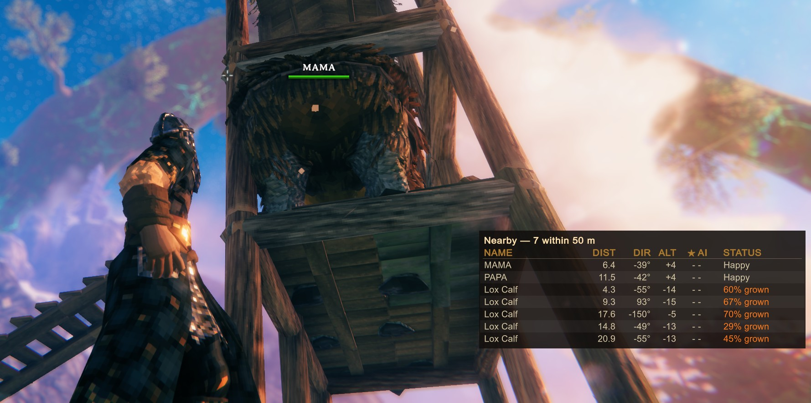
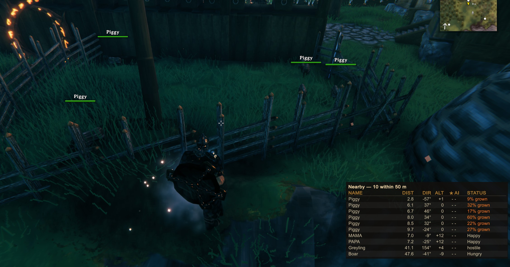

# NearbyPanel

[](https://thunderstore.io/c/valheim/p/I3_rett/NearbyPanel/)
[](https://github.com/I3-rett/NearbyPanel/actions/workflows/ci.yml)
[](LICENSE)
[](https://www.valheim.com/)
[](https://thunderstore.io/c/valheim/p/denikson/BepInExPack_Valheim/)

A client-side Valheim mod. Press **N** for a list of the creatures and fish around you:
distance, direction, altitude, star rating, what each one has noticed, live taming and
growth progress, and why a tamed animal is or is not breeding.

Client-side only. The server does not need it, it will not stop you joining a server that
does not have it, and players without it see nothing different.





## Why

Watching a breeding pen means walking up to each animal and reading its hover text, one at
a time, close enough to almost touch it — taming progress only shows within interaction
range, and only after the animal has eaten. This puts the same information in one list,
and adds what else is nearby and whether any of it has noticed you.

## Scope

The list covers every creature within 50 m, so it sees through trees and fog. Fish count
too: they show their size in the ★ column and, under STATUS, the baits the species bites
on. Two limits are constants in the source rather than settings: the radius, because a
limit you can slide is not a limit, and the exclusion of other players.

## Installing

**With a mod manager.** Search for **NearbyPanel** in r2modman, Gale or the Thunderstore
app and install it. BepInEx comes with it.

[thunderstore.io/c/valheim/p/I3_rett/NearbyPanel](https://thunderstore.io/c/valheim/p/I3_rett/NearbyPanel/)

**By hand.** Install
[BepInExPack Valheim](https://thunderstore.io/c/valheim/p/denikson/BepInExPack_Valheim/)
first, then take the zip from the
[latest release](https://github.com/I3-rett/NearbyPanel/releases/latest) and extract
`NearbyPanel.dll` and `NearbyPanel.Core.dll` into `BepInEx/plugins/NearbyPanel/`.

Either way, `LogOutput.log` should contain
`NearbyPanel <version> loaded (client-side only).` once the game starts. Settings appear on
first launch at `BepInEx/config/I3_rett.NearbyPanel.cfg`, and in Configuration Manager if
you have it.

Nothing to do on the server.

## Console commands

Both need Valheim's console, which is off by default: enable it in the game's settings, or
add `-console` to the launch parameters (r2modman: **Settings → Launch parameters**). Then
press **F5** in game.

- `nearby_filter <text>` shows only creatures whose name contains the text, e.g.
  `nearby_filter lox`; `nearby_filter fish` shows only fish. With no argument it clears
  the filter. Also a setting.
- `nearby_dump` writes the list as the panel shows it, same filter, to the console and to
  `BepInEx/LogOutput.log`. Under each animal that breeds it adds what the breeding checks
  counted: its ranges, and every animal considered with its 3-D and ground distance, height
  and whether it is ready to mate. That is the place to look when a pen reads `Crowded` or
  `No partner` and you cannot see why.

Neither marks your character as having used cheats. When reporting a bug, attach
`LogOutput.log` with a `nearby_dump` taken at the moment it happened.

## Building

Requires the .NET SDK 8 or later and an installed copy of Valheim — the plugin references
the game's own assemblies from the Steam folder, so this is Windows-only in practice.

```sh
git clone https://github.com/I3-rett/NearbyPanel.git
cd NearbyPanel
dotnet build
```

Valheim is found through the Steam registry key, and BepInEx in the r2modman `Default`
profile, falling back to the game folder. Override either:

```sh
dotnet build -p:GamePath="D:\Games\Valheim" -p:BepInExPath="D:\Games\Valheim\BepInEx"
```

A plain build writes to `bin/` and nowhere else. Installing into a BepInEx profile is
opt-in, so that building never drops a half-finished plugin into a game you play:

```sh
dotnet build -p:Deploy=true -p:BepInExPath="%APPDATA%\r2modmanPlus-local\Valheim\profiles\Dev\BepInEx"
```

To produce the Thunderstore package:

```powershell
powershell -File build/Package.ps1
```

It checks that `package/manifest.json` and `PluginInfo.cs` agree on the version, that the
icon is 256x256, and that every file made it into the zip before reporting success.

## Testing

```sh
dotnet test
```

Two kinds of test.

**Unit tests** over `NearbyPanel.Core`, which targets netstandard2.0 and cannot reference
UnityEngine or BepInEx. That restriction is what makes the project testable at all: the
geometry, the ordering, the filtering and the row formatting are pure functions over plain
data, and a stray `using UnityEngine` there will not compile.

**API guard tests** over the installed game assemblies. The plugin binds to Valheim by name
at runtime, so when Iron Gate renames or hides a member nothing fails at build time — you
find out as a `MissingMethodException` mid-session. These read `assembly_valheim.dll` and
`assembly_guiutils.dll` with Mono.Cecil and assert that every game member the plugin uses
still exists, with the same shape and visibility. One test per member, so a failure points
straight at the call site.

If Valheim is somewhere unusual, point `VALHEIM_MANAGED` at it; an explicit value replaces
the default search rather than adding to it:

```sh
VALHEIM_MANAGED="D:\Games\Valheim\valheim_Data\Managed" dotnet test
```

Without the game assemblies the guards can assert nothing, so they return quietly. That
would be a silent hole, and `GuardsAreArmedTests` fails the run when it happens. On a
machine with no Valheim, acknowledge it explicitly:

```sh
NEARBYPANEL_ALLOW_MISSING_GAME=1 dotnet test tests/NearbyPanel.Tests/NearbyPanel.Tests.csproj
```

Note the explicit project path. A bare `dotnet test` builds the whole solution including
the plugin, whose references point into the game folder, so without Valheim it fails before
any test runs. The test project references Core alone and builds anywhere — which is also
how CI runs it.

Anything touching Unity, the network or a live world cannot be covered here and is checked
by hand instead.

## Contributing

- **Keep game types out of Core.** The conversion belongs at the adapter boundary in
  `EntityMapper`.
- **Prefer moving a decision into Core over testing it in place.** If a rule can be
  expressed over primitives, it belongs where it can be tested.
- **Add an API guard test** when you bind to a new game member, and delete one when you
  stop using a member. A guard for something the code no longer touches is a false alarm.
- **Read values off the live component.** `m_tamingTime` and friends are serialized per
  prefab and are not in the assembly.
- **Only read.** No RPC, no `ZDO.Set`, no Harmony patch on anything networked. Some
  innocent-looking game getters write: `Character.GetHoverName()` can write back a legacy
  id for a tamed animal, which is why the name is read from the record instead.
- **Never commit game binaries.** Valheim's and Unity's assemblies are distributed under
  the Steam EULA, which grants no redistribution right. `.gitignore` blocks them.

## Licence

[MIT](LICENSE), covering this mod's own code. It links against Valheim's and Unity's
assemblies and redistributes none of them.
